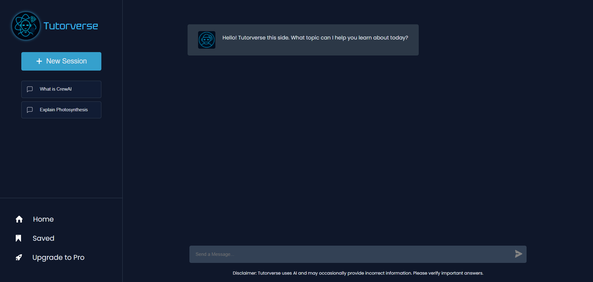
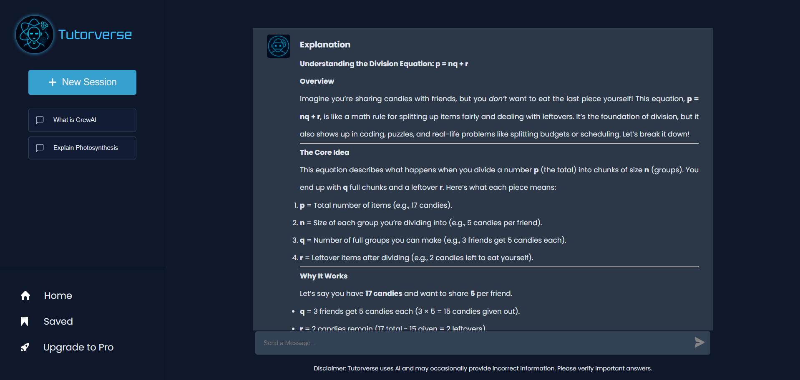

-----

# 🎓 Tutorverse - AI Tutor Web App

Tutorverse is an **AI-powered tutoring platform** built with **React (frontend)** and **FastAPI (backend)**. It provides an interactive learning experience using multiple AI agents such as a Tutor, Quizzer, Evaluator, and Monitor.

-----

## 📌 Project Structure

```bash
Tutorverse/
├── backend/            # FastAPI + AI Agents (CrewAI/OpenAI)
│   ├── main.py
│   ├── agents.py
│   ├── tasks.py
│   └── requirements.txt
│
├── frontend/           # React + Vite + Tailwind
│   ├── src/
│   ├── package.json
│   └── vite.config.js
│
├── README.md
└── .gitignore
```

-----

## 🚀 Getting Started

### 🔹 Backend (FastAPI + CrewAI Agents)

```bash
# Navigate to the backend directory
cd backend

# Create and activate a virtual environment (recommended)
python -m venv venv
# On Windows
venv\Scripts\activate
# On macOS/Linux
source venv/bin/activate

# Install dependencies
pip install -r requirements.txt

# Run the development server
uvicorn main:app --reload

# Server will be running at http://127.0.0.1:8000
```

### 🔹 Frontend (React + Vite + CSS)

```bash
# Navigate to the frontend directory
cd frontend

# Install dependencies
npm install

# Run the development server
npm run dev

# Frontend will be running at http://localhost:5173
```

-----

## 🧠 Features

  * 📘 **Tutor Agent:** Explains concepts in detail.
  * 📝 **Quiz Agent:** Generates quizzes to test your knowledge.
  * ✅ **Evaluator Agent:** Checks answers and provides instant feedback.
  * 🛠 **Monitor Agent:** Ensures the reliability and quality of other agents.
  * ⚡ **Tech Stack:** Built with React, FastAPI, and the CrewAI/OpenAI API.

-----

## 📷 Screenshots




-----

## 📜 License

This project is intended for educational purposes. Feel free to fork, modify, and extend it\! 🚀